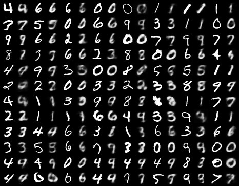
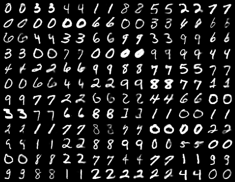
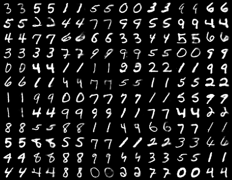
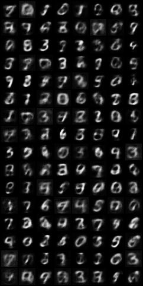
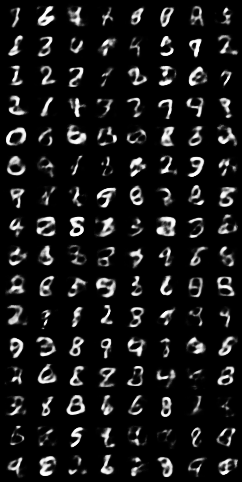
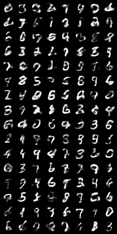

## VAE Pytorch Implementation
This is the Pytorch implementation of variational auto-encoder, applying on MNIST dataset.

### Usage
```python
$ python train.py
```
The code is self-explanatory, you can specify the num_epoch you want in the function `run()`.

### Result
I just trained the VAE ~ 30 epochs. Here are some visualization result.

- reconstruction result (1,10,20 respectively)  







- randomly generated digits (1,10,20 respectively)  







